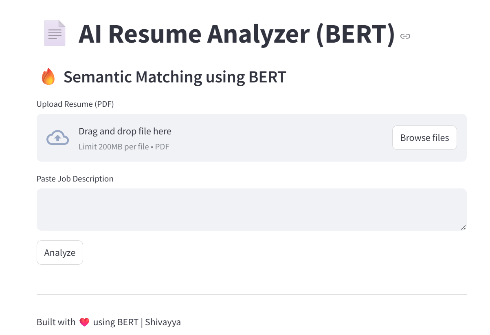

# 📄 AI Resume Analyzer 🚀


---

## 🌐 Live Demo

👉[Live Demo](https://ai-resume-analyzer-shivayya.streamlit.app/)

---

## 🎯 Project Highlights

- 🔥 BERT-based semantic resume matching  
- 🤖 AI-powered human-like feedback  
- 📊 Match score with cosine similarity  
- 🧠 Skill gap detection system  
- 📄 ATS compatibility analysis  
- 💻 Interactive UI using Streamlit
- 
---
## 📸 Screenshots

### 🏠 Home Page


### 📊 Result Page


## 🧠 Overview

AI Resume Analyzer is a smart web application that helps users evaluate how well their resume matches a job description.

Unlike basic keyword matching systems, this project uses **Sentence-BERT** to understand the **semantic meaning** of text and provide more accurate insights.

---

## ⚙️ How It Works

1. Upload your resume (PDF)
2. Paste job description
3. System processes both inputs
4. BERT converts text → embeddings
5. Cosine similarity calculates match score
6. AI generates:
   - Match percentage
   - Missing skills
   - Detailed feedback
   - ATS suggestions

---

## 🛠️ Tech Stack

- Python
- Streamlit
- Sentence Transformers (BERT)
- Scikit-learn
- PyPDF2

---

## 📂 Project Structure

```bash
resume-analyzer/
│
├── app.py
├── requirements.txt
├── README.md
├── screenshots/      
│   ├── home.png
│   ├── result.png
